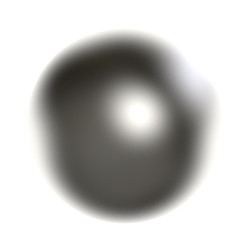

---
output:
  github_document:
    html_preview: false
---

[](http://cran.rstudio.com/web/packages/mie/index.html)
[](http://cran.rstudio.com/web/packages/mie/index.html)

Implementation of Mie scattering theory for light scattering by spherical particles.

```{r, echo=FALSE, out.width=100, fig.align='center'}

```

### License

[](http://www.gnu.org/licenses/gpl-2.0.html)

[](https://zenodo.org/badge/latestdoi/3128881)


